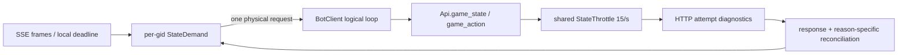

## Context

当前 `BotClient._play_loop()` 已经把一阵 SSE 帧合并为一次唤醒，并通过
`StateThrottle` 将每个令牌的 `/state` 物理尝试纳入共享 15/s、EDF 和 429
反馈。但 `StateDemand` 目前主要是唤醒队列：窗口确认、seq=0 重锚和普通
SSE 增量仍由主循环中的多个布尔状态拼接。一个 gid 在请求返回前继续收到
SSE 或窗口事件时，缺少显式的目标 watermark、原因集合和代际信息，难以证明
是否产生了重复物理请求，也难以在返回后分别判断“重锚完成”和“窗口确认完成”。

窗口身份已有 `source_discard_seq` 优先逻辑，但旧夹具/旧协议仍可能只有牌河、
副露计数或快照 watermark。真实 `tile_discarded` 事件自身的 `seq` 是该弃牌事件
的 source sequence；而 `/state` 的 `snap["seq"]` 只是包含式 watermark。因此只
允许事件自身 seq 或协议显式 source 字段承担身份，snapshot watermark 不能跨
seq=0 重锚承担安全去重语义。

HTTP 层已有 `urlopen` 聚合耗时和 `response.read()` 耗时，足以区分响应头前与
响应体阶段，但还需要明确时间点和 Retry-After/Date 的原始值，才能把窗口内
409/超时拆成客户端排队、客户端 HTTP 尾延迟或服务端窗口竞态。

线上验收还存在分母问题：工具中断、日志缺尾或协议没有 `round_ended` 时，房级
指标不能和完整房混算。本 change 以加法式记录和 fake-clock 回归为主，不改变
15/s、BOT 策略、动作提交安全边界或服务端协议。



## Goals / Non-Goals

**Goals:**

- 为每个可确认窗口提供稳定、可审计的 `WindowId` 和按阶段的
  `WindowAttemptKey`，让 `peng → chi` 仍是同一次机会。
- 在每个 gid 上保证最多一个物理 `/state` 在途；合并目标 watermark、原因、
  优先级、截止和 generation，同时保留每个逻辑 reason 的独立完成条件。
- 记录 state/action 的 throttle 与 HTTP 阶段边界，明确哪些阶段不可观测，
  并保留 Retry-After、server Date 的 raw 值和可选解析结果。
- 对 transport、window、game 分层记录 `complete`、`partial`、
  `protocol_skipped`，各层只用自身可判定完整的数据进入对应 A/B 主指标，并能
  量化窗口确认和 demand 合并是否真的降低物理请求。
- 在不改变现有动作安全边界的前提下，提供可回放、可 fake-clock 验证的契约。

**Non-Goals:**

- 不提高或降低默认 state rate，不引入 `not_before`/release-aware EDF，不改
  `StateThrottle` 的现有 15/s 排序和 429 反馈行为。
- 不调整启发式 BOT、policy checkpoint、sleep、动作策略或窗口协议时序。
- 不提前提交动作、不根据不权威快照授权动作、不对 409/未知结果重发旧 POST。
- 不把 `snap["seq"]`、牌河长度或副露数升级为窗口的权威身份；事件自身的
  `tile_discarded.seq` 与协议显式 source 字段除外。
- 不把 partial 房补成完整房，也不为缺失的 `round_ended` 伪造游戏结算证据。

## Decisions

### D1. WindowId 是源弃牌身份，phase 只进入尝试键

冻结以下结构：

```text
WindowId = (
    game_id,
    round_id,
    discard_owner,
    source_discard_seq,
    tile,
)
WindowAttemptKey = (WindowId, phase)
```

`WindowAttemptKey` 是窗口阶段的逻辑分组/动作防重键，不是物理请求的唯一
attempt id。同一个 `WindowAttemptKey` 可能因为重复确认而对应多个逻辑请求；每个
逻辑 state/action 请求另有唯一的 `logical_request_id`，其物理尝试按该逻辑请求从
`attempt_index=1` 递增。这样可以同时表达“同一 `response_peng` 窗口”和“第一次、
第二次实际抓取”这两个不同维度。

`source_discard_seq` 必须来自协议明确的源弃牌序号，或 `tile_discarded` 事件自身
的 event seq；同一次弃牌从
`response_peng` 转为 `response_chi` 时只改变 `phase`，不得创建第二个
`WindowId`。窗口身份变化的判据是局号、出牌者、源序号或牌值变化，不能依赖
牌河数量或快照 watermark。

每个窗口记录另带诊断字段 `identity_origin`，取
`explicit_source_field`、`tile_discard_event_seq`、`carried_event_seq` 或
`legacy_snapshot`。它只说明身份来源，不改变 `identity_status` 的权威判断，且不
参与 `WindowId` 的逻辑相等性；这样可以区分“协议没有提供身份”和“事件已收到但
身份在 seq=0 重锚时沿用”的两类 legacy 证据。

*替代方案*：继续以 `Mirror.window_key()` 的牌河/副露计数作为主键。该方案在
增量 claim 移牌、seq=0 全量快照保留历史表示时会产生同窗不同键或新窗同键，
因此只能保留为诊断字段。

### D2. legacy 身份只可观测，不可承担跨重锚安全语义

生产路径无法得到 `source_discard_seq` 时生成 `legacy/unresolved` 标签，并在
日志中保留可见的弱 fallback（例如旧计数）供排障。该标签不得在 seq=0 重锚
后阻止一次新的确认/动作，也不得证明当前快照与旧窗口相同；强去重只接受
authoritative `WindowId`。实现可在同一个未重锚响应批次内做局部降噪，但必须把
局部去重与跨重锚安全去重分开记录。

*替代方案*：为了兼容旧夹具，把计数 fallback 继续当作等价 WindowId。这样会
把不稳定的观察值变成动作授权依据，风险高于兼容收益；旧夹具应迁移到显式
`source_discard_seq` 或标记为 unresolved。

### D3. StateDemand 是 per-gid 物理请求协调器，旧 SSE queue 只是输入

每个 gid 拥有一个协调对象，至少维护：

```text
watermark_target        # 只表示增量 watermark，按 max 合并
full_snapshot_required  # 是否有 reason 要求 seq=0 全量快照
reasons:
    SSE_DELTA:
        wanted_seq
        status              # SATISFIED | TERMINAL | PENDING
    RESYNC:
        cause
        requested_at
        status              # SATISFIED | TERMINAL | PENDING
    WINDOW_CONFIRM:
        window_id
        phase
        deadline
        status              # SATISFIED | TERMINAL | PENDING
generation              # 语义状态实际变化时递增
in_flight               # 当前是否已有物理请求

# 以下均由仍为 PENDING 的 reasons 派生，不是唯一事实来源
kind_priority           # WINDOW_CONFIRM > RESYNC > SSE_DELTA
effective_deadline      # 剩余 reason deadline 的最早值
reason_mask             # PENDING reasons 的按位 OR
```

SSE 帧只更新 `SSE_DELTA.wanted_seq` 和派生的 `watermark_target`，不推进镜像游标；
`RESYNC`/`WINDOW_CONFIRM` 可以把 `full_snapshot_required` 置为 true，但
`seq=0` 不参与 watermark 的数值 max。物理请求选择固定为：

```text
if full_snapshot_required:
    game_state(seq=0)
else:
    game_state(seq=local_applied_cursor)
```

`local_applied_cursor` 由 BotClient 的镜像消费进度提供；`watermark_target` 只用于
协调、诊断和返回后的覆盖判断，不能让增量请求跳过尚未应用的事件。`seq=0` 返回
的快照仍包含实际 watermark，可以同时满足已覆盖的 `SSE_DELTA`。
一个请求在途期间到达的新需求只更新对应 reason 的 metadata；只有语义状态实际
变化时才递增 generation。重复的同一 watermark、重复 reason metadata 或更低的
watermark 不得仅因到达而递增 generation。当前请求完成后，必须先按最新
`StateDemand` 做 reason-specific reconciliation；每次 completion 最多创建一个
successor request，后续 completion 仍可在最新 demand 仍有 PENDING reason 时继续
创建 successor。所有物理尝试（含 429/网络重试）仍通过同一个
`Api.state_throttle`。

*替代方案*：在主循环里继续增加条件分支或为每种 reason 各开一个请求。前者
无法证明代际竞态，后者会直接放大共享配额压力；独立协调器能把物理请求合并
和逻辑完成判断解耦。

### D4. 逻辑 reason 独立判断，generation 防止在途竞态

返回一个 `/state` 后，协调器不能用“seq=0 已返回”一次性清空所有需求。分别
判断：

- `RESYNC`：BotClient 已成功应用权威快照按该 reason 的 cause 完成重建，且若 reason 带有目标
  watermark，则返回 watermark 覆盖该目标。
- `SSE_DELTA`：返回结果的 watermark 覆盖其 `wanted_seq`；未覆盖则保留
  `PENDING`。
- `WINDOW_CONFIRM`：同一个 authoritative `WindowId` 仍在当前局面，phase
  正确，本家仍在 `responding_seats`，快照有精确截止且截止仍有效时为
  `SATISFIED`。

每个 reason 的结果固定为三类：

```text
SATISFIED  # 已满足，不再重试
TERMINAL   # 已确认不可再满足，不再重试，但保留终态原因
PENDING    # 权威事实还不足或目标尚未追上，保留并可重试
```

对 `WINDOW_CONFIRM`，phase 已推进、`WindowId` 已变化、截止已过或权威快照已
证明本家不再具备响应资格时记为 `TERMINAL`；快照仍是旧 phase、服务端
watermark 尚未推进或缺少足够权威字段时记为 `PENDING`，不能用含糊的
`unconfirmed` 无限重试。只有 `PENDING` reason 留在 active `StateDemand`；某个
reason 完成或终止后，必须从剩余 PENDING reasons 重新计算
`full_snapshot_required`、`kind_priority`、`effective_deadline` 和
`reason_mask`。`UNKNOWN`/缺精确 deadline 的 PENDING 必须共享同一窗口的 retry
deadline 或 bounded retry budget；预算耗尽时转为不记 claim_miss 的终态，不能在
每个旧快照上重复 state abandon/auto-play 计数。

窗口 phase 按有序转移解析，而不是简单相等比较：期望
`response_chi` 但实际仍为同一 `WindowId` 的 `response_peng` 时，在 chi 的调度
截止仍有效时返回 `PENDING`（不得写 `claim_miss`）；期望 `response_peng` 而实际
已经是 `response_chi` 时才是旧 peng reason 的 `TERMINAL`。resolver 必须先比较
`WindowId`，不能用包含 phase 的 `WindowAttemptKey` 判断 peng/chi 是否同窗。

请求发出时保存 `started_generation`。若响应返回时当前 generation 已变化，
先用响应事实对当前 demand 重新执行上述 reason-specific reconciliation；generation
变化本身 MUST NOT 触发补请求。只有 reconciliation 后仍存在 PENDING reason，才能
为这次 completion 创建一个 successor；不能用旧响应覆盖新窗口，也不能丢掉仍未
满足的低优先级 reason。例如请求发出时目标为 100，在途期间 SSE 推进到 103，
返回快照 watermark=110，则即使 generation 已变化，也不创建 successor。

### D5. 需求优先级与无意义 urgent 降级保持简单

调度排序固定为 `WINDOW_CONFIRM > RESYNC > SSE_DELTA`，同类仍沿用现有 EDF
和过期降级。BotClient 完成本地合法集检查后，若当前弃牌对本家没有任何非
pass 合法碰/杠/吃动作，则不持有窗口 urgent deadline，回到 SSE 普通追赶；但
“无非 pass 合法动作”只能由与当前 local phase 无关的结构性合法候选证明，或
由当前 authoritative snapshot 证明无响应资格。不得仅凭
`mirror.legal_actions()`、本地尚未进入 `response_peng/response_chi`、stale
phase 或 unresolved identity 降级。`catch_play`、phase 未确认或 identity
unresolved 时，只要结构性证明/权威快照尚未成立，就必须保留
`WINDOW_CONFIRM`。这只是减少无意义需求，不改变“必须看到权威
`response_chi`/`response_peng` 快照后才能动作”的边界。

### D6. HTTP 阶段只记录可证明的边界

每个 state attempt 必须用本地 monotonic 记录 `throttle_enter`（进入共享
`StateThrottle` 等待前）、`throttle_granted`（取得许可时）和
`queue_wait_ms=throttle_enter → throttle_granted`。action 若不经过
`StateThrottle`，对应字段必须为 `null`/`not_applicable`，不得伪造为 0；若未来
经过该 throttle，则记录真实的两个时间点。上述 throttle 边界与 HTTP 边界独立，
每次 physical attempt 都单独记录。

每个物理 state/action attempt 使用本地 monotonic 计算耗时：

```text
http_start       = urlopen 调用前
headers_received = urlopen() 返回后
body_finished    = response.read() 返回后
pre_read_ms      = http_start → headers_received
read_ms          = headers_received → body_finished
total_ms         = http_start → body_finished
```

正常响应中，`headers_received` 是 `urlopen()` 返回时；urllib 的 HTTP 4xx/5xx
会抛出 `HTTPError`，此时 headers 已经收到，`headers_received` 记为捕获
`HTTPError` 的时刻。正常响应的 `body_finished` 是 `response.read()` 返回时；
若读取 `HTTPError` 的 error body，则是 `e.read()` 完成时，读取失败则保持
`null`。没有收到 headers 的网络异常不伪造该边界。

`pre_read_ms` 是 DNS、connect、TLS、请求写入和等待响应头的聚合，不能拆成
独立阶段；`dns_ms`、`connect_ms`、`tls_ms`、`send_ms` 明确写 `null`/unavailable。
HTTPError 或 body 读取失败时仍记录已到达的边界，不因解析失败丢失物理尝试。

每次 retry 都重新经过 throttle 并拥有自己的阶段记录；逻辑 req/action 记录
聚合物理 attempts，同时保留各 attempt 列表。`deadline_left_at_send` 与
`deadline_left_at_response` 只用本地 monotonic deadline 计算，server Date 不
参与控制。

### D7. Retry-After 和 server Date 同时保留 raw 与解析值

从响应头读取并原样保存：`retry_after_raw`、`server_date_raw`。在可解析时额外
保存 `retry_after_seconds` 和 `server_date_epoch`；Retry-After 既支持十进制秒
也支持 HTTP-date，无法解析时解析字段为 null 但 raw 仍保留。解析失败、负值
或不可信时不改变现有限流/重试决策。

### D8. 验收按房间完整性分层，主指标只用 complete

房间报告不再把完整性压成一个互斥的房级标签，而是对 transport、window、game
分别记录层级状态：

```text
transport_status: complete | partial
window_status:    complete | partial
game_status:      complete | partial | protocol_skipped
```

`partial` 只排除受影响层；`protocol_skipped` 表示协议缺少某层的证明，不应把
同一房间的 transport/window 证据一起作废。例如没有 `round_ended` 时可以是
`transport_status=complete`、`window_status=complete`、
`game_status=protocol_skipped`。Transport 指标只使用 transport complete 的房，
window 指标只使用 window complete 的房，game 指标只使用 game complete 的房；
工具中断或日志缺尾按实际受影响层标为 partial。

房报告仍分层包含 transport（429/409/uncertain/queue）、window
（eligible/confirm requested/confirmed/submitted/timeout/miss）和 game
（round started/ended、分数对账）指标，并报告 demand 合并明细：

```text
logical_demands
coalesced_demands
successor_requests
physical_state_requests
suppressed_duplicates
coalescing_ratio = 1 - physical_state_requests / logical_demands
```

其中 `logical_demands` 是每次向协调器提交的逻辑需求事件；一次 completion 只有在
仍有 PENDING reason 且实际创建 successor physical request 时，`successor_requests`
与 `logical_demands` 才各增加一次，避免在后续 reason-specific resolver 清除需求后
把不存在的 successor 计入 ratio。
`coalesced_demands` 是被合并进已有 pending/in-flight demand 且改变了其语义
状态的事件，`suppressed_duplicates` 是相同或被更高 watermark 支配、未改变
语义状态的重复事件。`physical_state_requests` 是协调器新启动物理 `/state`
请求数，retry attempts 另行统计为 `physical_state_attempts`；
`logical_demands=0` 时 `coalescing_ratio` 为 `null`。各字段按 gid/game 记录，避免把
正常 reason 合并和重复通知混成一个数字。还需增加
`WINDOW_CONFIRM seq=0 / eligible_windows`，其中 `eligible_windows` 必须来自有权威
WindowId、存在非 pass 合法候选的 phase-independent 窗口账本，按 WindowId 去重；
legacy/unresolved 单独报告，不得进入 authoritative 分母。并单独报告各层 complete/partial/
protocol_skipped 数量。`end` 若没有显式 demand snapshot，记录器必须回退到该房
最后一个 req demand，并标记 `demand_source=end|req_fallback|missing`；验收工具对
旧日志也按同一优先级恢复，但 fallback 证据必须可区分于完整 end snapshot。

验收工具还应把每个可观测 gap 分类为 `snapshot_reanchor`、
`sse_batch_catchup`、`transport_retry_related` 或 `event_discontinuity`，无法判断时
归入 `log_truncation_or_unknown`，并记录 gap 到下一次 authoritative snapshot 前
是否已经产生决策。只有 `event_discontinuity` 且 `decision_impact=true` 才进入强风险
汇总，不能把所有 `gap` 计数直接解释为丢窗口。

### D9. 先观测再实验，保持运行变量冻结

实现后先跑 focused fake-clock 回归、完整 `tests/` 和 `git diff --check`，再以
启发式 BOT、SSE+增量 `/state`、15/s 收集 3～5 个房，并按所需层筛选
`status=complete` 的数据。此阶段不改 rate、sleep、EDF 或策略；只有在新观测
证明普通队列仍有问题时，另开 change 做参数实验。线上运行中不编辑代码、不并
跑同令牌重负载。

## Risks / Trade-offs

- [需求协调器引入新的代际状态，可能漏清或重复补请求] → 所有合并字段和
  reason 完成条件写成 fake-clock 场景；请求返回后按最新 demand reconcile，
  每次 completion 最多一个 successor，并分别记录 logical/coalesced/physical/
  suppressed 计数。
- [legacy 窗口无法强身份化，旧夹具会出现 unresolved] → 保留原始弱字段供诊断，
  将安全去重限制在 authoritative WindowId；迁移夹具补齐 source sequence。
- [增加日志字段扩大单行体积或影响旧回放] → 字段全部可选、JSON-safe，旧日志
  缺字段按 unknown 读取，不改变动作/回放协议。
- [urlopen 阶段仍无法细分 DNS/connect/TLS/send] → 明确记录 unavailable，避免
  把聚合 pre-read 误报成单个阶段；如未来换传输库，另开兼容性 change。
- [某一层 complete 分母变少，短期统计看起来更差] → 同时报告各层
  complete/partial/protocol_skipped 数量，允许仍完整的 transport/window 层
  继续统计，禁止用缺尾证据掩盖受影响层的窗口漏失。

## Migration Plan

1. 以 `3ae3fd6` 为基线，先落地本 change 的 WindowId/StateDemand/诊断字段，
   不改变 15/s 和动作协议；旧日志读取保持兼容。
2. 先运行 focused fake-clock 与 recorder/API 回归，再运行完整 `python3 -m
   pytest tests/ -q` 和 `git diff --check`。
3. 线上先跑一房启发式 BOT canary；按 transport/window/game 三层状态归档，
  后续 3～5 房基线按所需层分别纳入。`protocol_skipped` 仅排除不可验证的
  game 层，`partial` 仅排除受影响层。
4. 若发现回归，回滚本 change 的代码提交即可；`catch_play` 的 `3ae3fd6` 独立
   保留或按其自身证据单独回滚，不与本 change 联动。

## Open Questions

- 线上协议实际提供的源弃牌字段可能存在 `source_discard_seq`、
  `last_discard_seq` 等版本别名；实现时逐字段记录来源，`tile_discarded` 自身
  event seq 作为协议没有别名时的 authoritative fallback，其他 payload 在无法
  确认权威语义时统一标为 `legacy/unresolved`。
- 现有历史日志的 `round_ended` 覆盖不足；验收脚本需要区分“协议未提供”与
  “工具/日志缺尾”，不能仅凭缺少一条记录直接归为同一类。
- 若后续 3～5 个房的对应 complete 层样本仍显示 urgent 排队尾部超标，再单独
  评估 `not_before/release-aware EDF`；本 change 不预先决定该参数实验。
