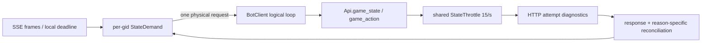

## Context

当前 `BotClient._play_loop()` 已经把一阵 SSE 帧合并为一次唤醒，并通过
`StateThrottle` 将每个令牌的 `/state` 物理尝试纳入共享 15/s、EDF 和 429
反馈。但 `StateDemand` 目前主要是唤醒队列：窗口确认、seq=0 重锚和普通
SSE 增量仍由主循环中的多个布尔状态拼接。一个 gid 在请求返回前继续收到
SSE 或窗口事件时，缺少显式的目标 watermark、原因集合和代际信息，难以证明
是否产生了重复物理请求，也难以在返回后分别判断“重锚完成”和“窗口确认完成”。

窗口身份已有 `source_discard_seq` 优先逻辑，但旧夹具/旧协议仍可能只有牌河、
副露计数或快照 watermark。增量 claim 会改变牌河，而 `/state` 的 `snap["seq"]`
只是包含式 watermark；因此这些值不能跨 seq=0 重锚承担安全去重语义。

HTTP 层已有 `urlopen` 聚合耗时和 `response.read()` 耗时，足以区分响应头前与
响应体阶段，但还需要明确时间点和 Retry-After/Date 的原始值，才能把窗口内
409/超时拆成客户端排队、客户端 HTTP 尾延迟或服务端窗口竞态。

线上验收还存在分母问题：工具中断、日志缺尾或协议没有 `round_ended` 时，房级
指标不能和完整房混算。本 change 以加法式记录和 fake-clock 回归为主，不改变
15/s、BOT 策略、动作提交安全边界或服务端协议。



## Goals / Non-Goals

**Goals:**

- 为每个可确认窗口提供稳定、可审计的 `WindowId` 和按阶段的
  `WindowAttemptKey`，让 `peng → chi` 仍是同一次机会。
- 在每个 gid 上保证最多一个物理 `/state` 在途；合并目标 watermark、原因、
  优先级、截止和 generation，同时保留每个逻辑 reason 的独立完成条件。
- 记录 state/action 的 throttle 与 HTTP 阶段边界，明确哪些阶段不可观测，
  并保留 Retry-After、server Date 的 raw 值和可选解析结果。
- 用 `complete`、`partial`、`protocol_skipped` 分类房间，只有可判定完整房进入
  A/B 主指标，并能量化窗口确认和 demand 合并是否真的降低物理请求。
- 在不改变现有动作安全边界的前提下，提供可回放、可 fake-clock 验证的契约。

**Non-Goals:**

- 不提高或降低默认 state rate，不引入 `not_before`/release-aware EDF，不改
  `StateThrottle` 的现有 15/s 排序和 429 反馈行为。
- 不调整启发式 BOT、policy checkpoint、sleep、动作策略或窗口协议时序。
- 不提前提交动作、不根据不权威快照授权动作、不对 409/未知结果重发旧 POST。
- 不把 `snap["seq"]`、牌河长度或副露数升级为 legacy 窗口的权威身份。
- 不把 partial 房补成完整房，也不为缺失的 `round_ended` 伪造游戏结算证据。

## Decisions

### D1. WindowId 是源弃牌身份，phase 只进入尝试键

冻结以下结构：

```text
WindowId = (
    game_id,
    round_id,
    discard_owner,
    source_discard_seq,
    tile,
)
WindowAttemptKey = (WindowId, phase)
```

`source_discard_seq` 必须来自协议明确的源弃牌序号；同一次弃牌从
`response_peng` 转为 `response_chi` 时只改变 `phase`，不得创建第二个
`WindowId`。窗口身份变化的判据是局号、出牌者、源序号或牌值变化，不能依赖
牌河数量或快照 watermark。

*替代方案*：继续以 `Mirror.window_key()` 的牌河/副露计数作为主键。该方案在
增量 claim 移牌、seq=0 全量快照保留历史表示时会产生同窗不同键或新窗同键，
因此只能保留为诊断字段。

### D2. legacy 身份只可观测，不可承担跨重锚安全语义

生产路径无法得到 `source_discard_seq` 时生成 `legacy/unresolved` 标签，并在
日志中保留可见的弱 fallback（例如旧计数）供排障。该标签不得在 seq=0 重锚
后阻止一次新的确认/动作，也不得证明当前快照与旧窗口相同；强去重只接受
authoritative `WindowId`。实现可在同一个未重锚响应批次内做局部降噪，但必须把
局部去重与跨重锚安全去重分开记录。

*替代方案*：为了兼容旧夹具，把计数 fallback 继续当作等价 WindowId。这样会
把不稳定的观察值变成动作授权依据，风险高于兼容收益；旧夹具应迁移到显式
`source_discard_seq` 或标记为 unresolved。

### D3. StateDemand 是 per-gid 物理请求协调器，旧 SSE queue 只是输入

每个 gid 拥有一个协调对象，至少维护：

```text
wanted_seq       # 目标 watermark，max 合并
kind_priority    # WINDOW_CONFIRM > RESYNC > SSE_DELTA
deadline         # 有效截止中的最早值
reason_mask      # RESYNC/WINDOW_CONFIRM/SSE_DELTA 按位 OR
generation       # 每次新需求合并时递增
in_flight        # 当前是否已有物理请求
```

SSE 帧只更新 `wanted_seq`，不推进镜像游标；窗口确认和重锚需求可将目标提升
为 seq=0，但不得另起第二个同 gid 请求。一个请求在途期间到达的新需求只更新
上述字段并递增 generation；当前请求完成后最多补发一次面向最新目标的物理请求。
所有物理尝试（含 429/网络重试）仍通过同一个 `Api.state_throttle`。

*替代方案*：在主循环里继续增加条件分支或为每种 reason 各开一个请求。前者
无法证明代际竞态，后者会直接放大共享配额压力；独立协调器能把物理请求合并
和逻辑完成判断解耦。

### D4. 逻辑 reason 独立判断，generation 防止在途竞态

返回一个 `/state` 后，协调器不能用“seq=0 已返回”一次性清空所有需求。分别
判断：

- `RESYNC`：权威快照/返回 watermark 覆盖该 reason 的 wanted watermark，且
  镜像已在该事实边界重建。
- `SSE_DELTA`：返回结果的 watermark 覆盖其目标；未覆盖则保留需求。
- `WINDOW_CONFIRM`：同一个 authoritative `WindowId` 仍在当前局面，phase
  正确，本家仍在 `responding_seats`，快照有精确截止且截止仍有效；任何一项
  不满足都不能把确认标为成功，应记录 closed/stale/unconfirmed 等结果。

请求发出时保存 `started_generation`。若响应返回时当前 generation 已变化，
先用响应事实分别结算旧 reason，再按最新 wanted_seq/kind/deadline 只补一次请求；
不能用旧响应覆盖新窗口，也不能丢掉仍未满足的低优先级 reason。

### D5. 需求优先级与无意义 urgent 降级保持简单

调度排序固定为 `WINDOW_CONFIRM > RESYNC > SSE_DELTA`，同类仍沿用现有 EDF
和过期降级。BotClient 完成本地合法集检查后，若当前弃牌对本家没有任何非
pass 合法碰/杠/吃动作，则不持有窗口 urgent deadline，回到 SSE 普通追赶；
这只是减少无意义需求，不改变“必须看到权威 `response_chi`/`response_peng`
快照后才能动作”的边界。

### D6. HTTP 阶段只记录可证明的边界

每个物理 state/action attempt 使用本地 monotonic 计算耗时：

```text
http_start       = urlopen 调用前
headers_received = urlopen() 返回后
body_finished    = response.read() 返回后
pre_read_ms      = http_start → headers_received
read_ms          = headers_received → body_finished
total_ms         = http_start → body_finished
```

`pre_read_ms` 是 DNS、connect、TLS、请求写入和等待响应头的聚合，不能拆成
独立阶段；`dns_ms`、`connect_ms`、`tls_ms`、`send_ms` 明确写 `null`/unavailable。
HTTPError 或 body 读取失败时仍记录已到达的边界，不因解析失败丢失物理尝试。

每次 retry 都重新经过 throttle 并拥有自己的阶段记录；逻辑 req/action 记录
聚合物理 attempts，同时保留各 attempt 列表。`deadline_left_at_send` 与
`deadline_left_at_response` 只用本地 monotonic deadline 计算，server Date 不
参与控制。

### D7. Retry-After 和 server Date 同时保留 raw 与解析值

从响应头读取并原样保存：`retry_after_raw`、`server_date_raw`。在可解析时额外
保存 `retry_after_seconds` 和 `server_date_epoch`；Retry-After 既支持十进制秒
也支持 HTTP-date，无法解析时解析字段为 null 但 raw 仍保留。解析失败、负值
或不可信时不改变现有限流/重试决策。

### D8. 验收按房间完整性分层，主指标只用 complete

房间/局日志先分类：

```text
complete:
  正常 end；必要日志完整；round/game completeness 可判定
partial:
  工具中断、日志缺尾、缺 end 或无法闭合关键事件
protocol_skipped:
  协议本身不提供 round_ended 等证据，明确标注不可验证
```

`partial` 和 `protocol_skipped` 可以进入故障/诊断样本，但不得进入 rate、
claim_miss、queue 等房级 A/B 主汇总。完整房报告至少包含：transport（429/409/
uncertain/queue）、window（eligible/confirm requested/confirmed/submitted/
timeout/miss）、game（round started/ended、分数对账）三层指标，并增加
`WINDOW_CONFIRM seq=0 / eligible windows` 与 `duplicate/coalesced state demands / game`。

### D9. 先观测再实验，保持运行变量冻结

实现后先跑 focused fake-clock 回归、完整 `tests/` 和 `git diff --check`，再以
启发式 BOT、SSE+增量 `/state`、15/s 收集 3～5 个 complete 房。此阶段不改 rate、
sleep、EDF 或策略；只有在新观测证明普通队列仍有问题时，另开 change 做参数
实验。线上运行中不编辑代码、不并跑同令牌重负载。

## Risks / Trade-offs

- [需求协调器引入新的代际状态，可能漏清或重复补请求] → 所有合并字段和
  reason 完成条件写成 fake-clock 场景；请求返回后只按 generation 与最新目标
  决定一次补发，并记录 coalesced/duplicate 计数。
- [legacy 窗口无法强身份化，旧夹具会出现 unresolved] → 保留原始弱字段供诊断，
  将安全去重限制在 authoritative WindowId；迁移夹具补齐 source sequence。
- [增加日志字段扩大单行体积或影响旧回放] → 字段全部可选、JSON-safe，旧日志
  缺字段按 unknown 读取，不改变动作/回放协议。
- [urlopen 阶段仍无法细分 DNS/connect/TLS/send] → 明确记录 unavailable，避免
  把聚合 pre-read 误报成单个阶段；如未来换传输库，另开兼容性 change。
- [complete 分母变少，短期统计看起来更差] → 同时报告 complete/partial/
  protocol_skipped 数量，禁止用缺尾房掩盖窗口漏失。

## Migration Plan

1. 以 `3ae3fd6` 为基线，先落地本 change 的 WindowId/StateDemand/诊断字段，
   不改变 15/s 和动作协议；旧日志读取保持兼容。
2. 先运行 focused fake-clock 与 recorder/API 回归，再运行完整 `python3 -m
   pytest tests/ -q` 和 `git diff --check`。
3. 线上先跑一房启发式 BOT canary；按三类完整性归档，只有 complete 房进入
   后续 3～5 房基线。`partial`/`protocol_skipped` 只保留为诊断样本。
4. 若发现回归，回滚本 change 的代码提交即可；`catch_play` 的 `3ae3fd6` 独立
   保留或按其自身证据单独回滚，不与本 change 联动。

## Open Questions

- 线上协议实际提供的源弃牌字段可能存在 `source_discard_seq`、
  `last_discard_seq` 等版本别名；实现时需逐字段记录来源，并在无法确认权威
  语义时统一标为 `legacy/unresolved`。
- 现有历史日志的 `round_ended` 覆盖不足；验收脚本需要区分“协议未提供”与
  “工具/日志缺尾”，不能仅凭缺少一条记录直接归为同一类。
- 若后续 3～5 个 complete 房仍显示 urgent 排队尾部超标，再单独评估
  `not_before/release-aware EDF`；本 change 不预先决定该参数实验。
